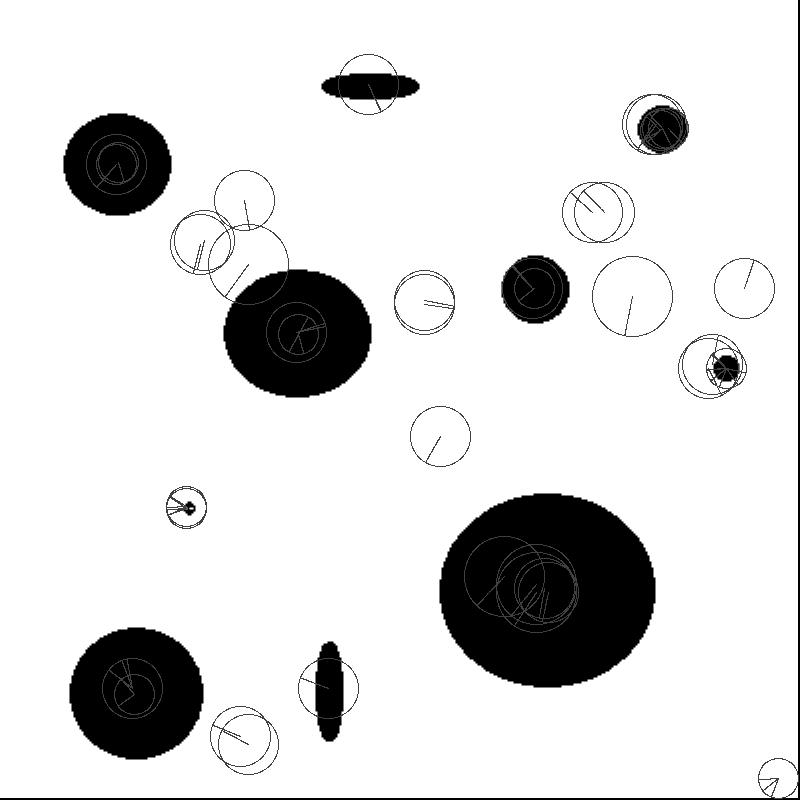

# Sift
Sift implemention in Rust. https://www.cs.ubc.ca/~lowe/papers/ijcv04.pdf

Fast implmentation in Rust. http://citeseerx.ist.psu.edu/viewdoc/download?doi=10.1.1.60.3991&rep=rep1&type=pdf

## Orb

## Fast Corner

## Sift
Too many false positives.

