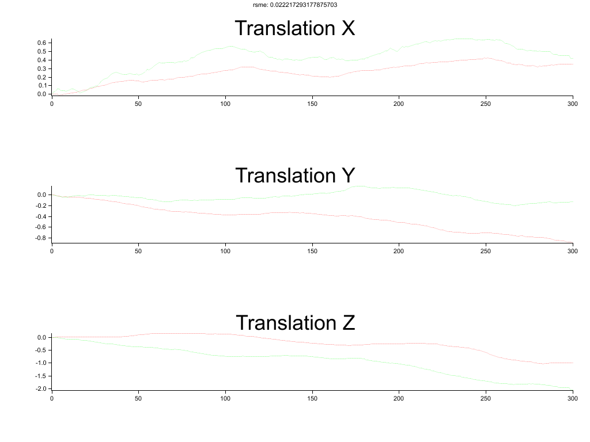

# Papers Implemented
Sift implemention in Rust. https://www.cs.ubc.ca/~lowe/papers/ijcv04.pdf

Fast implmentation in Rust. http://citeseerx.ist.psu.edu/viewdoc/download?doi=10.1.1.60.3991&rep=rep1&type=pdf

Orb implementation in Rust. http://www.willowgarage.com/sites/default/files/orb_final.pdf

Dense VO implementation in Rust. https://ieeexplore.ieee.org/document/6631104

## Orb

## Fast Corner

## Dense VO

## Sift
Too many false positives.

