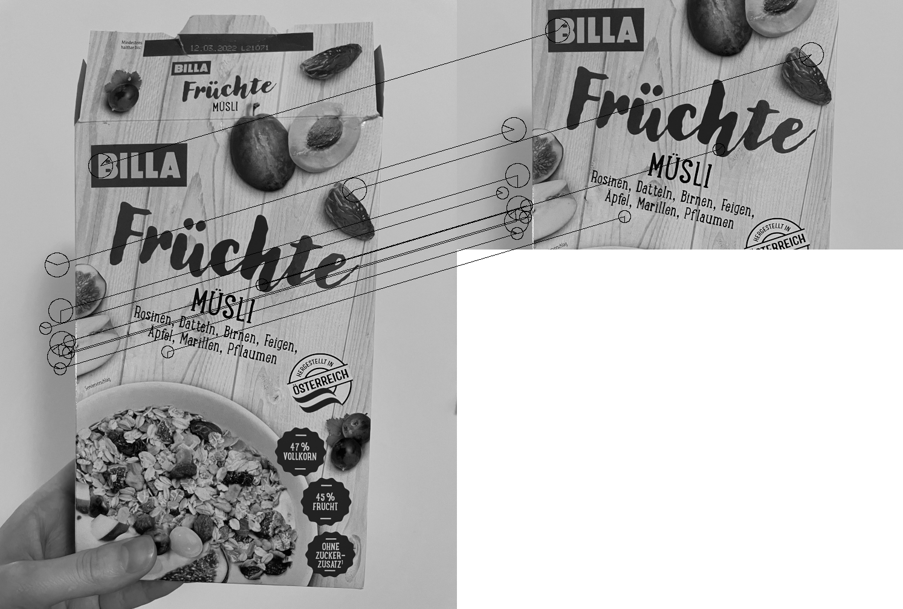
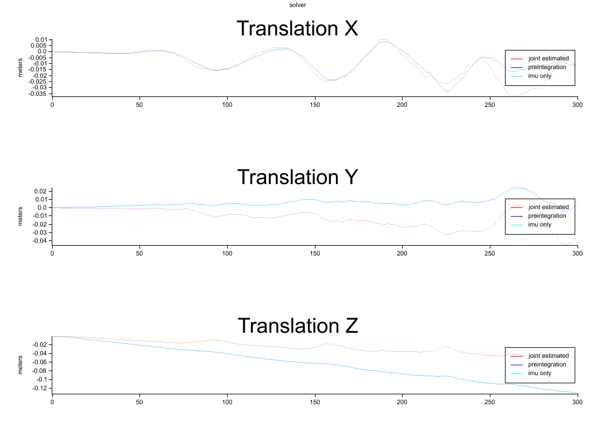
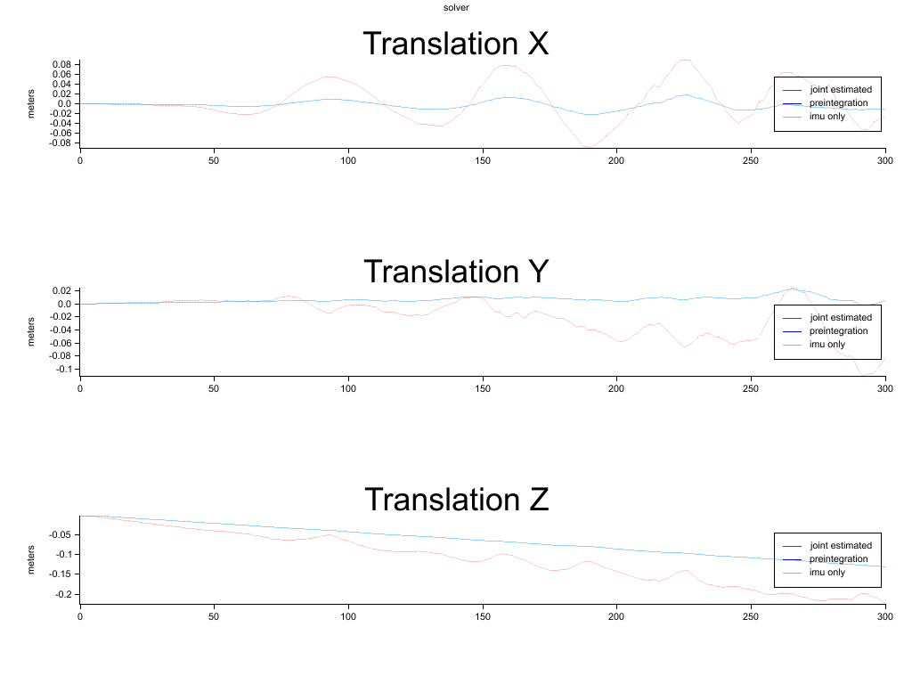

# Papers Implemented
Fast implmentation in Rust. http://citeseerx.ist.psu.edu/viewdoc/download?doi=10.1.1.60.3991&rep=rep1&type=pdf

Orb implementation in Rust. http://www.willowgarage.com/sites/default/files/orb_final.pdf

Dense VO implementation in Rust. https://ieeexplore.ieee.org/document/6631104

Imu Preintgration in Rust http://rpg.ifi.uzh.ch/docs/TRO16_forster.pdf

## Orb

## Fast Corner

## Dense VO (LM + SoftOneLoss) - Tum Dataset Freiburg2 Desk

## Visual-Interial Odometry - Realsense D455

### With Bias Estimation

### Without Bias Estimation

