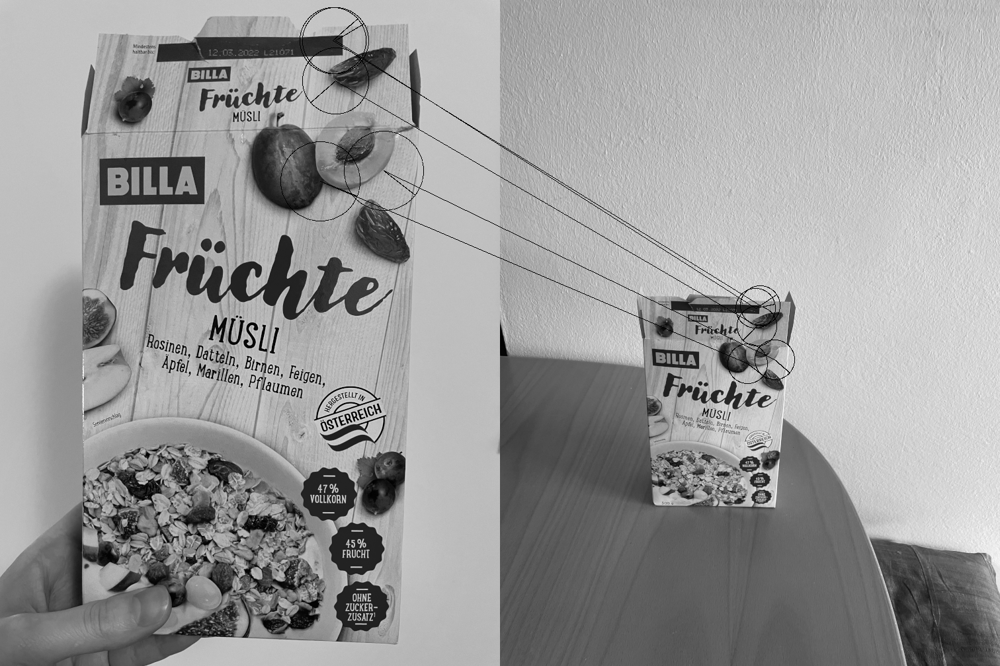
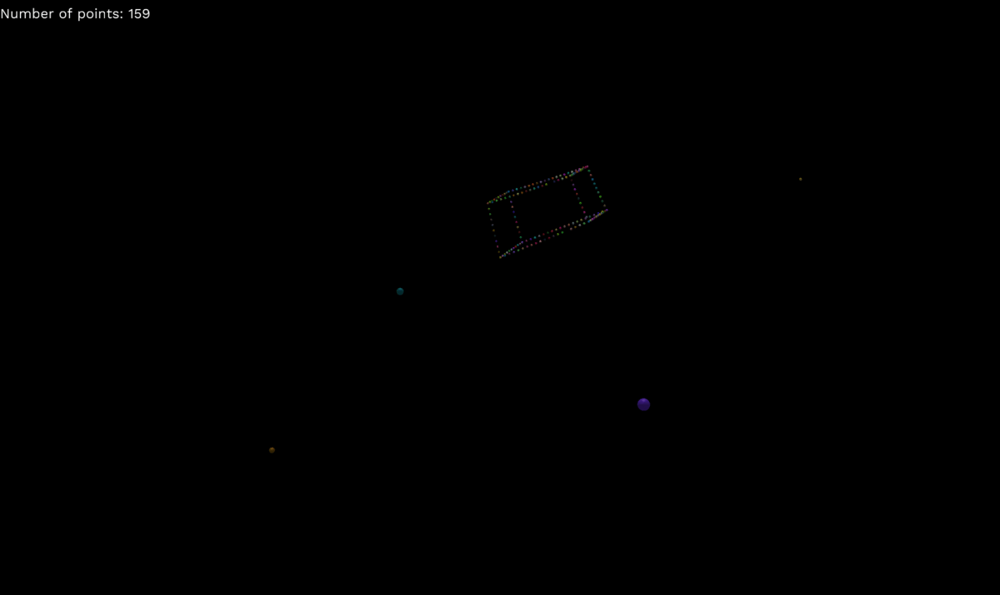
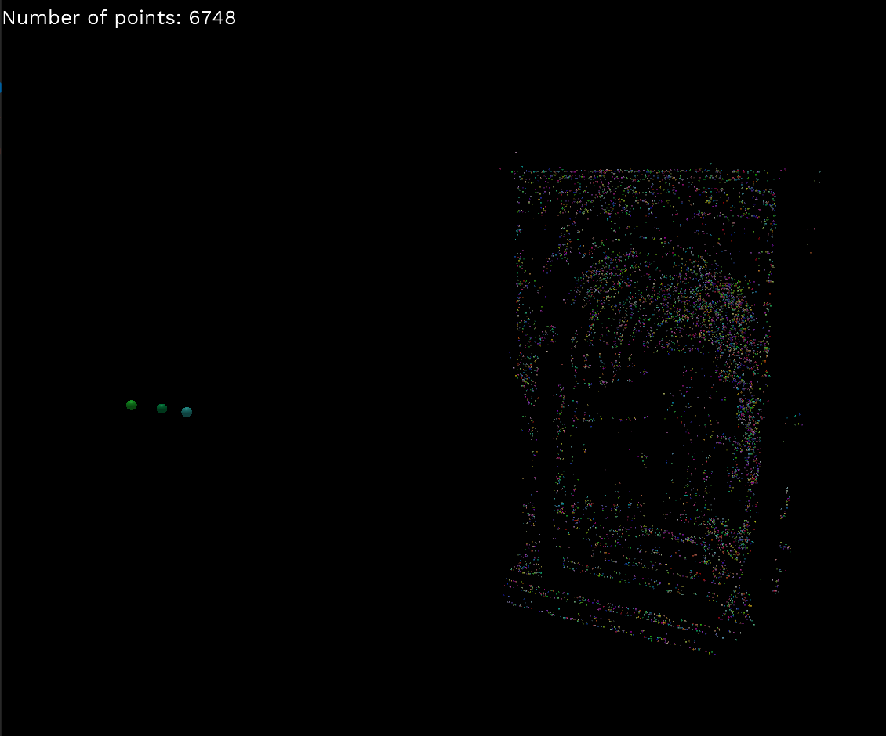
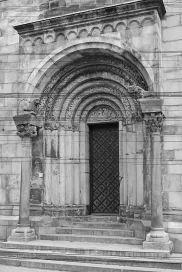
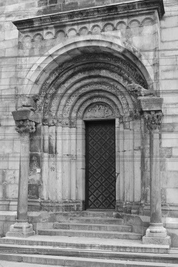
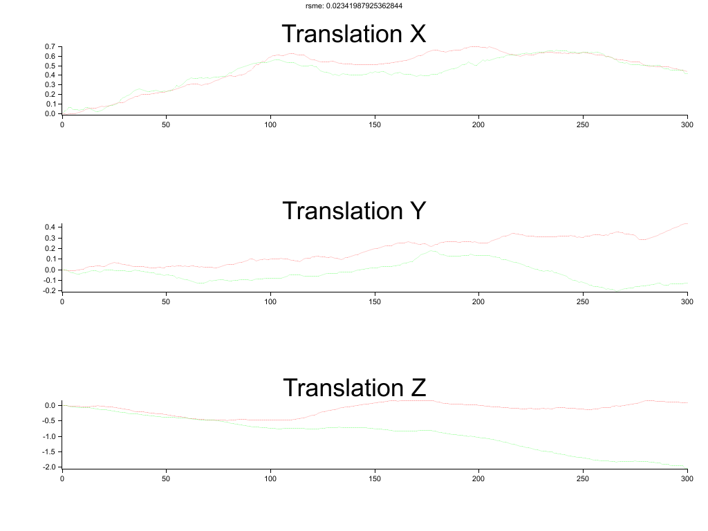

# Papers Implemented
Fast http://citeseerx.ist.psu.edu/viewdoc/download?doi=10.1.1.60.3991&rep=rep1&type=pdf

Orb http://www.gwylab.com/download/ORB_2012.pdf

Dense VO https://ieeexplore.ieee.org/document/6631104

Imu Preintgration http://rpg.ifi.uzh.ch/docs/TRO16_forster.pdf

Sparse Bundle Adjustment http://users.ics.forth.gr/~lourakis/sba/sba-toms.pdf

8 Point https://www.cse.unr.edu/~bebis/CS485/Handouts/hartley.pdf

Inverse Depth Parameterization https://www.doc.ic.ac.uk/~ajd/Publications/civera_etal_tro2008.pdf

Primal-Dual Convex For L1 Norm https://candes.su.domains/software/l1magic/downloads/l1magic.pdf (Based on: Convex Optimization – Boyd and Vandenberghe)

5 Point - https://citeseerx.ist.psu.edu/viewdoc/download?doi=10.1.1.61.9329&rep=rep1&type=pdf

## Orb

## Fast Corner

## Sparse BA (Euclidean / Inverse Depth Param - Essential / Fundamental as Initial Guess)

## Five Point (Data from Carl Olsson: https://www.maths.lth.se/matematiklth/personal/calle/)
 

## Dense VO (LM + SoftOneLoss) - Tum Dataset Freiburg2 Desk

